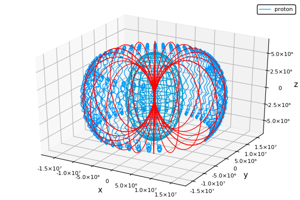

Exercise 1
==========
See the modified file `motion.jl`.

The mass and charge of the particle have been set to those of an electron
and positron. The fields and initial conditions have been set as follows:
```julia
elfield = [0.0, 1, 0]
magfield = [0.0, 0, 2]
initposition = [0.0, 0, 0]
initvelocity = [-1.0, 0, 0]
```

The solution is then calculated in a time interval of length 1E-10 s.
For both particles, we observe an E-B drift in the direction of the x-axis
(this is consistent with theory).
Each particle completes five gyration cycles in the specified interval.


Exercise 2
==========
Again, see the file `motion.jl`. A section has been added to calculate
the motion of a proton.
```julia
# Proton
p = Params(elemcharge, protonmass, elfield, magfield)
tspan = (0.0, 1.0E-7)
sol = solve(ODEProblem(derivs!, y0, tspan, p))
plot(sol, vars=(1,2), label="proton")
```

As can be seen in the code listing, the time span of the solution
has been increased by three orders of magnitude in order to see
at least a few full cycles.

The calculated trajectory is in the following figure:


Clearly, the radius of oscillation is much greater for proton: more than
by three orders of magnitude.
The drift velocity ratio of proton and electron can be estimated
by comparing the two plots: The proton drifted about 1000x further
in 1000x longer time interval, showing a linear relationship.
In other words, the drift velocity has not changed, which is in line
with theoretical predictions.

Exercise 3
==========
See file `motion2.jl`. Its structure is similar, but the `derivs!`
function now calculates the magnetic field based on the position
of the particle.

By setting the initial velocity to (1, 1, 0) m, the y_0 parameter
to 1 m, and the time span of solution to 0.005 s, one can observe
drift in the positive x-direction for both electron and positron.

```julia
initvelocity = [1, 1, 0]
yparam = 1
````


Exercise 4
==========
We approximate the magnetic field of Earth as that of a dipole.
For a dipole with magnetic moment m = (0, 0, m_z), the magnetic
field is:
```
(mu_0 m_z)/(4pi r^5)[3xz, 3yz, 3z^2 - r^2]
```
where r is the length of the position vector (x, y, z) and mu_0
is the permeability of free space.

Given the magnetic field at equator, the z-component of Earth's
magnetic field can be calculated. The value of m_z is
approximately 809E20 A m^2.

See the modified file `van_allen.jl` for implementation.

Exercise 5
==========

