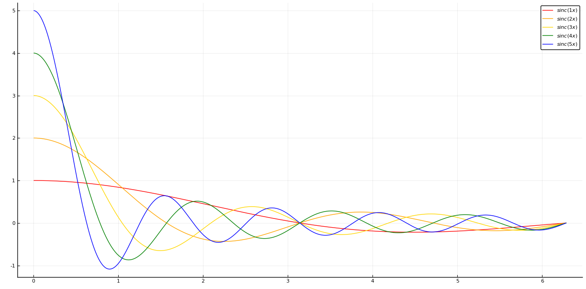
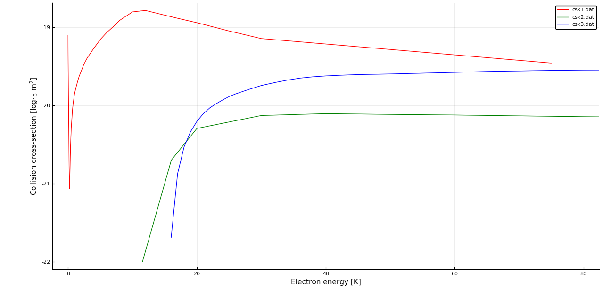

Exercise 1
==========
See the modified file `simple_plot.jl`.
The following snippet plots the desired functions:

```julia
for n in 1:5
    plot!(x, sin.(n*x)./x, c=colors[n], label=latexstring("sinc($(n)x)"))
end
```

Running the `simple_plot.jl` script produces the following figure:



Exercise 2
==========
See the modified file `data_plot.jl`. Running the script plots the data
and prints the minimum electron energy in each series.
The excitation threshold is about 11.55 eV, while the ionization threshold
is about 16.00 eV.



Exercise 3
==========
See the modified file `data_plot.jl`.
The following code writes the converted data to a tab-separated file:

```julia
using DelimitedFiles

# Write the results to file
outfile = "csev$(i).dat"
println("Writing $filename...")
writedlm(outfile, [x y])
```